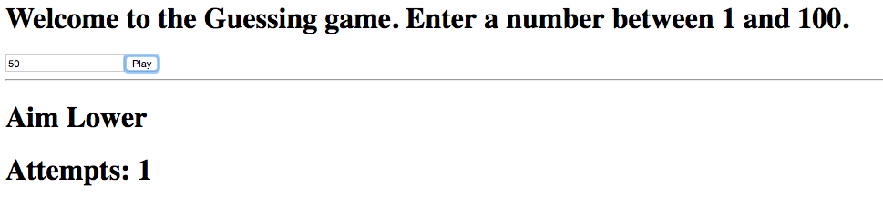
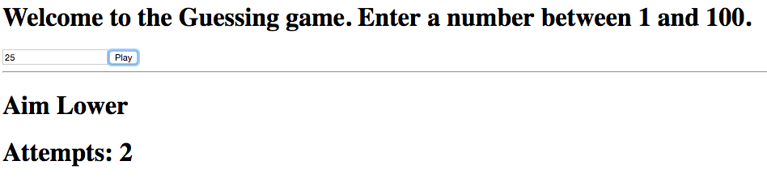
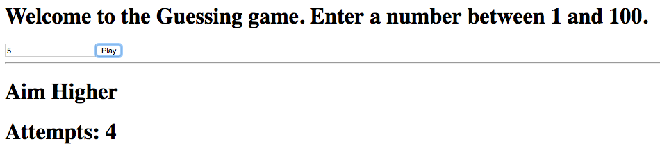

= Lab 04

[abstract]
In this lab you'll implement a guessing game(!!!) using NodeJS.

== Application
Have a look at the screenshot below. +

* Create a NodeJS application guessing-game
* Create index.html that contains the HTML code as shown in the screenshots below.
* Create gameserver.js and implement the logic. 
* Load the index.html file and hit the play button

* Implement a guessing game. 
* Your application will generate a random number between 1 and 100.
* User will play the game till he guesses the number correct.

* Given below are some screenshots
* image:01.png[]
* 
* 
* image:04.png[]
* 

* When you guess the number correct, display a message "You've got it!!!"
* If the user enters an invalid input, display an error message (Invalid Input) in red
* You can use express-session library to store the values in session, so every user plays her own game 
* Don't worry too much about the look and feel of the page
* Don't give up.
